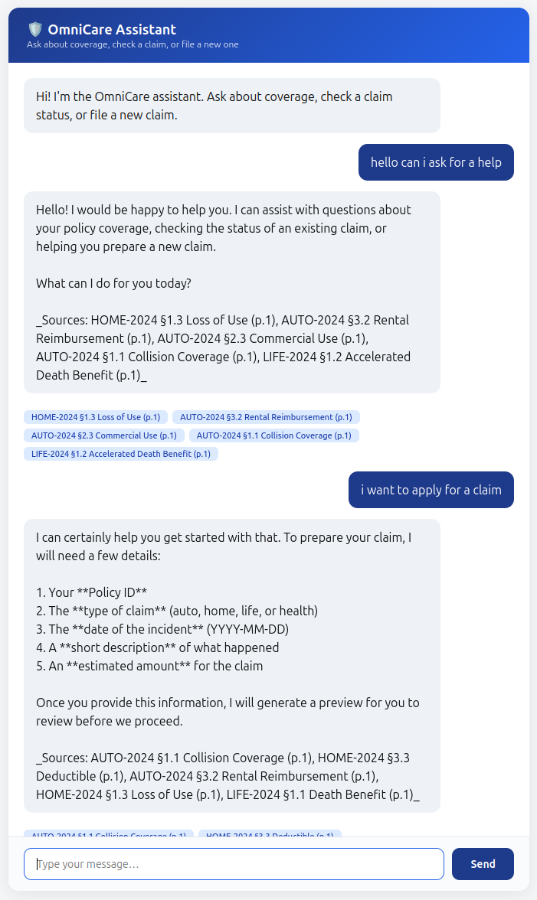

# OmniCare Assistant — UI Walkthrough

A look at what it's like to actually use the OmniCare Assistant, from opening the chat window to filing a claim.

---

## 1. The Chat Window

You're greeted with a clean, simple chat window. Just type your question or request like you would in any messaging app — no menus, no forms to fill out up front.

---

## 2. Asking About Your Coverage

Type a question like:

> "Is theft covered on my auto policy?"

The assistant answers in plain language and shows exactly where that answer came from — a small citation tag under the response (e.g. "AUTO-2024 §1.2, p.1") that you can click to see the original policy wording. No more digging through a 40-page PDF to find one clause.

Ask a follow-up like "what about flood damage on my home policy?" and it'll tell you clearly if something *isn't* covered too — with the same kind of source reference.

---

## 3. Checking a Claim

Mention a claim number and the assistant instantly pulls up its status:

> "What's the status of CLM-1002?"

You'll see a clean summary — status, filing date, adjuster assigned, and any notes — right in the chat, no waiting on hold or logging into a separate portal.

---

## 4. Filing a New Claim

Describe what happened in your own words:

> "I want to file a claim. Policy POL-001, auto, hit a deer on 2024-09-10, about $3,000 in damage."

The assistant doesn't just submit this right away. It shows you a **summary card** of everything it understood — policy, incident date, amount, description — so you can double check the details before anything is filed.

---

## 5. Confirming or Correcting

From that summary card, you have two options:

- **Confirm** — the claim is filed, and you get a claim number back immediately (e.g. `CLM-A3F9B2`) along with a note that a confirmation email is on the way.
- **Cancel / make changes** — nothing is filed. You can just tell the assistant what to fix ("actually the date was 2024-09-11") and it'll redo the summary for you to check again.

This gives you a chance to catch mistakes before they become part of your official claim record.

---

## 6. When the Assistant Can't Help

Not every question has a good answer — and the assistant is upfront about that:

- Ask something outside the scope of your policies (like "does this cover alien abduction?") and it'll tell you plainly it doesn't have that information, rather than guessing.
- If a message looks like it's trying to manipulate the assistant into ignoring its purpose, it'll politely decline and steer the conversation back to your policy or claims.

Either way, you're never left with a made-up or misleading answer.

---

## What It Feels Like End-to-End

| You do this... | You experience this... |
|---|---|
| Open the chat | A simple message box, ready to go |
| Ask a coverage question | A clear answer with a clickable source reference |
| Mention a claim number | An instant status summary |
| Describe a new claim | A review card to check before anything is filed |
| Ask something out of scope | An honest "I don't know" instead of a guess |

The overall experience is meant to feel like texting a very well-informed agent — one who always shows their work and never files anything on your behalf without asking first.
